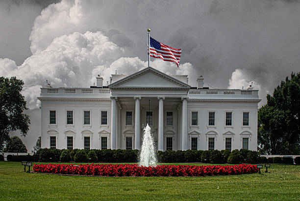
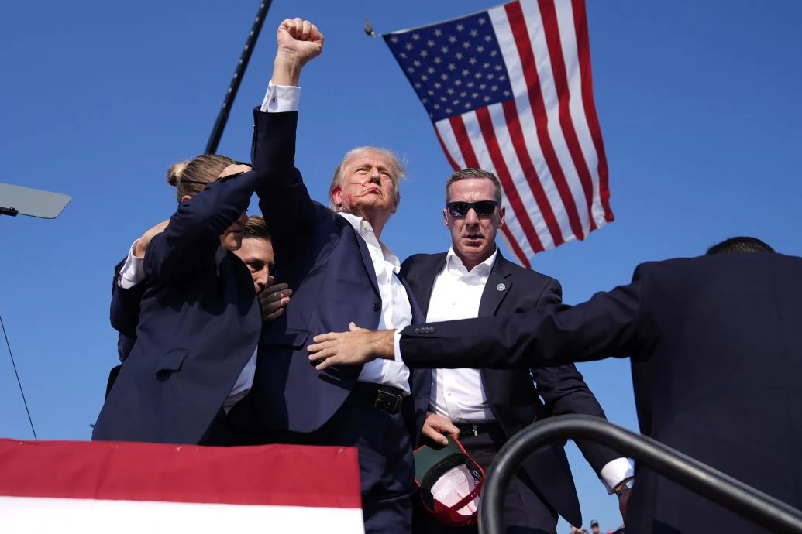

  
  <!-- Themed Symbols -->
  

    
    &nbsp;&nbsp;&nbsp;&nbsp;&nbsp;&nbsp;&nbsp;&nbsp;
    
    &nbsp;&nbsp;&nbsp;&nbsp;&nbsp;&nbsp;&nbsp;&nbsp;
    
  

  
  <!-- Themed Typing SVG Slogan -->
  
  
   

  <!-- Introduction Line -->
  <h3>
    Hi there , my name is <strong>Donald John Trump</strong>.
     
    I am the 45th President of the United States.
  </h3>
  

<!-- GitHub Stats Cards -->

  

---

### 🏛️ My American Journey

<table>
<tr>
<td valign="top">

From the battlefields of the **Revolutionary War** where the spirit of 1776 was forged, to the halls of **Independence Hall** where our Constitution was born, the story of America is one of resilience, innovation, and unwavering patriotism. We built the tallest skyscrapers, won two World Wars, put a man on the moon, and created the single greatest economic engine the world has ever seen.

My mission has always been to champion the forgotten men and women of this country, to rebuild our nation, and to restore the promise of the American Dream. We fought for fair trade, secured our borders, appointed conservative judges, and unleashed American energy. We put **America First**, because a nation must prioritize the well-being of its own citizens.

The challenges ahead are great, but the spirit of the American people is greater. We will not bend, we will not break, we will not yield. We will continue to fight for our values, our freedom, and our way of life. The best is yet to come!

</td>
</tr>
</table>

---

### 📞 Connect with Me

  
  
  
   
  

---

### 🇺🇸 Defining Moments in American History

    
    

