

  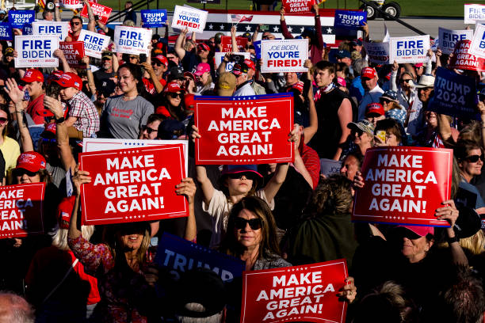
  <h1><strong>DONALD J. TRUMP</strong></h1>
  
  <h3><strong>45th President of the United States of America</strong></h3>
  

---

### 🏛️ **A Message to the American People** / 致美国人民的信 / アメリカ国民への手紙 / 치미국 인민적 일봉신

<table>
<tr>
<td valign="top">

They said it couldn't be done. They said our best days were behind us. They were wrong.

From the moment I came down that golden escalator, we embarked on a great national crusade to restore the promise of America for every citizen. We rejected the failed dogmas of the past and embraced a new vision: **AMERICA FIRST**.

We rebuilt our military, appointed a record number of conservative judges, and stood up to our adversaries on the world stage. We cut taxes for hardworking families, unleashed American energy, and created the greatest economy in the history of the world. We secured our borders and fought for fair trade deals that put American workers first.

This is not just a political movement; it is a testament to the enduring power of patriotism. It is the story of a nation rediscovering its confidence, finding its voice, and reclaiming its destiny. The challenges we face are immense, orchestrated by those who seek to undermine our foundations. But they underestimate the strength and the spirit of the American people. We will not be silenced. We will not be deterred. We will never, ever give up. The best is yet to come!

</td>
</tr>
</table>

---

### 📊 **My Record: By the Numbers** / 我的政绩：用数字说话 / 私の業績：数字が物語る / 내 업적: 숫자가 말해주는 것

*These stats reflect my unwavering commitment and tireless work ethic for our nation.*

<table align="center">
  <tr>
    <td align="center" valign="top">
      
    </td>
    <td align="center">
      
    </td>
  </tr>
</table>

  

---

### 📞 **Join the Movement** / 加入这场运动 / 運動に参加しよう / 운동에 참여하세요

  
  
  
  
   
  
  

---

### 🇺🇸 **Moments That Made America Great** / 让美国再次伟大的时刻 / アメリカを再び偉大に / 미국을 다시 위대하게 만들자

<b>Click to Expand Presidential Gallery / 点击展开总统图库 / クリックすると大統領ギャラリーが拡大されます / 대통령 갤러리를 확장하려면 클릭하세요</b>

 

    
    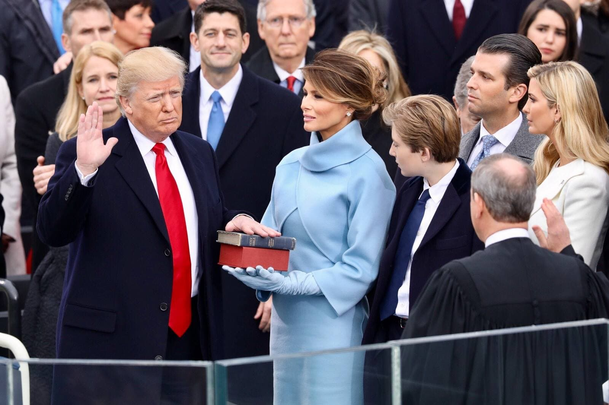
    
    
    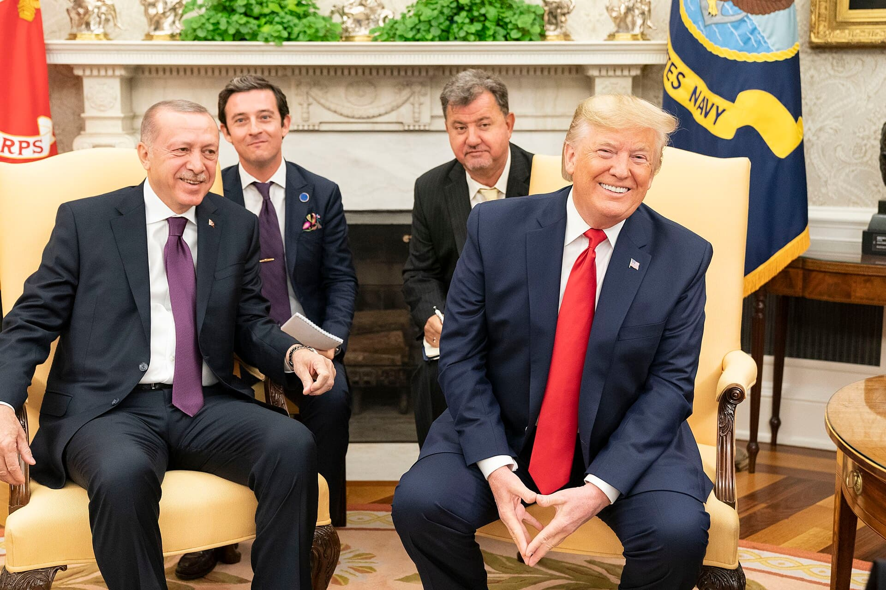
    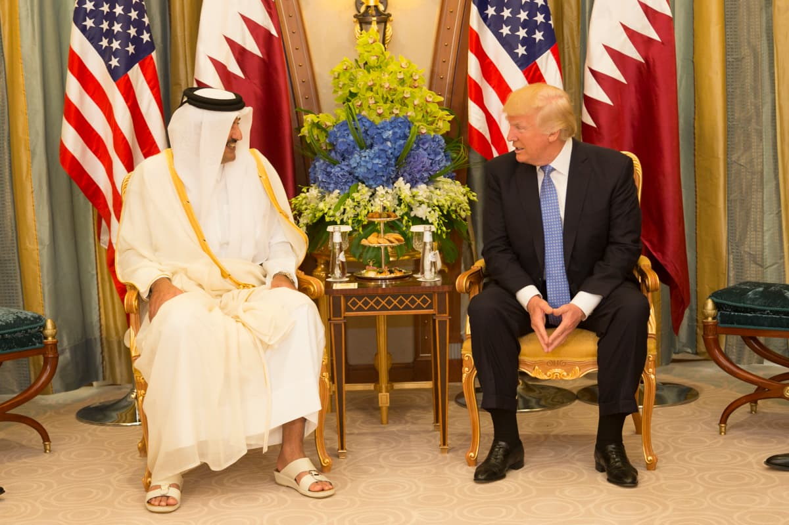
    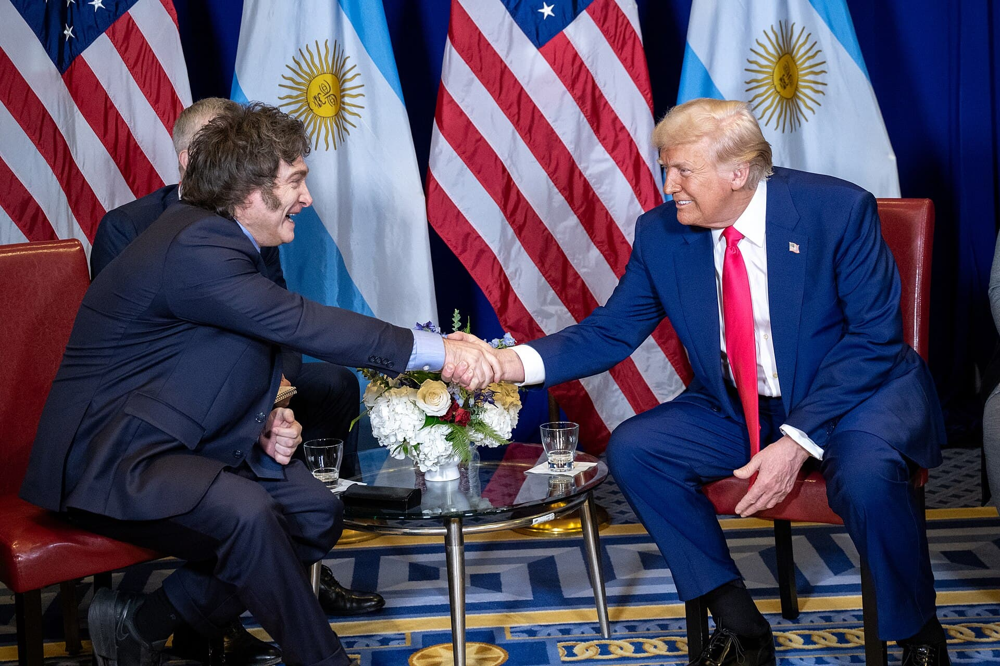
    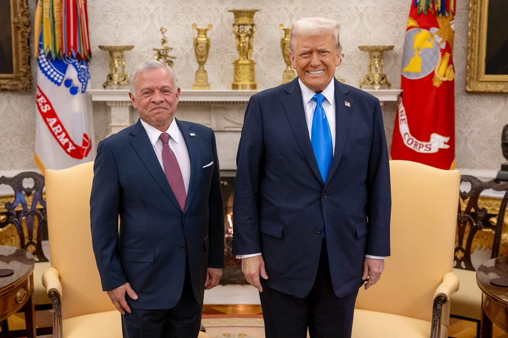
    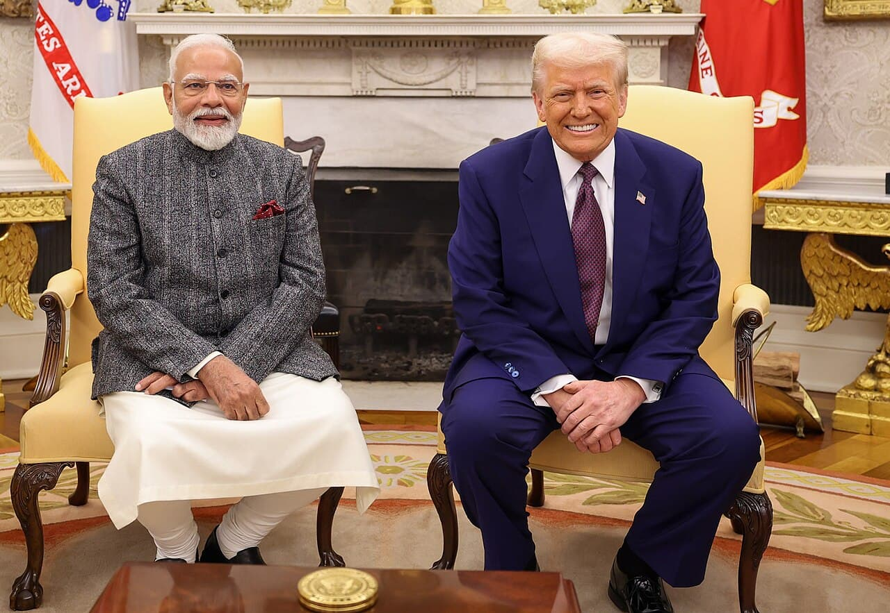
    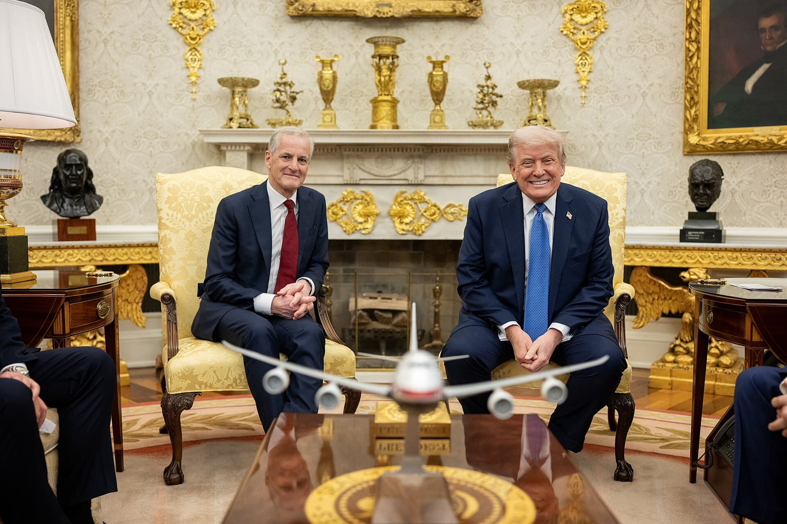
    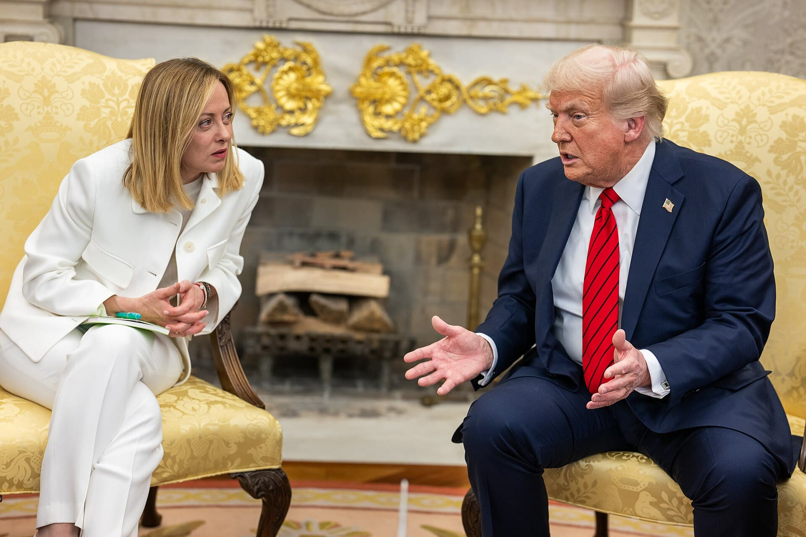
    
    
    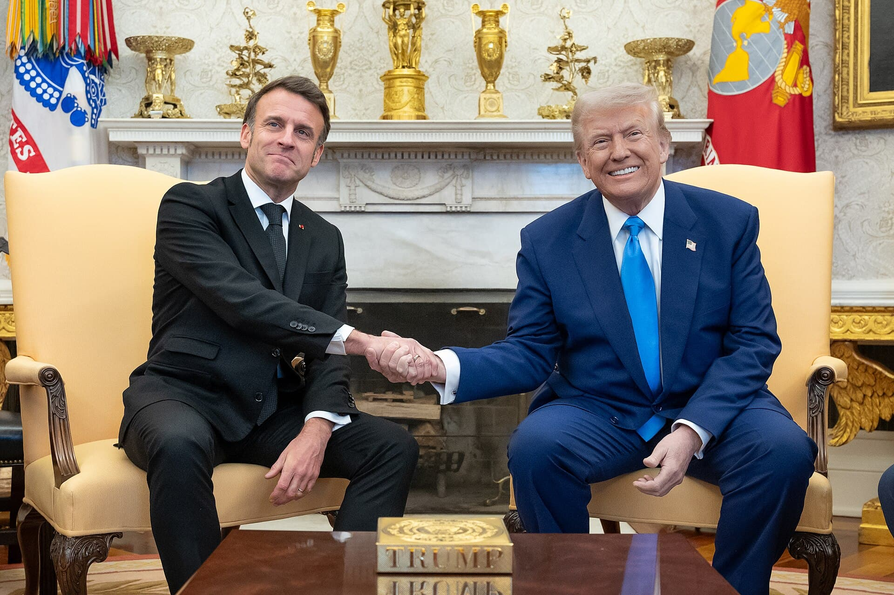
    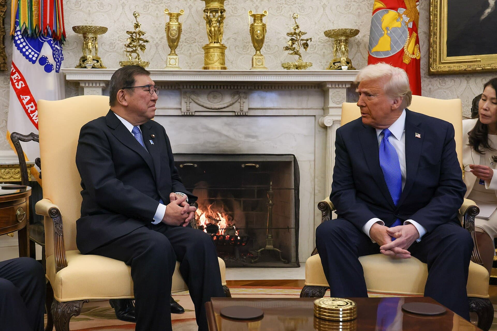
    
    
    

---

### 📜 **My Core Principles** / 我的核心信念 / 私の核となる信念 / 내 핵심 신념

*   **🇺🇸 America First (美国优先)**: Every decision, every policy, and every action must be judged by a simple test: does it make life better for American families? We must protect our borders, defend our sovereignty, and bring back our jobs.
*   **🗽 Strength Through Peace (以实力求和平)**: A strong nation is a safe nation. We rebuilt our military not to start conflicts, but to prevent them. When America is strong, the world is a safer place.
*   **⚖️ Constitutionalism (宪法主义)**: The foundation of our Republic is the Constitution. I am committed to appointing judges who interpret the Constitution as it is written, preserving our God-given liberties for generations to come.
*   **💼 Economic Prosperity (经济繁荣)**: By cutting taxes, slashing regulations, and unleashing the power of American enterprise, we created the greatest economic boom in history. Prosperity is the key to national strength and individual happiness.

---

### 🚀 **A Blueprint for the Future** / 未来蓝图

The work of making America great is never truly finished. We have laid the foundation, but now we must build upon it. My plan for the future is clear:

1.  **Unleash American Energy Dominance**: We will once again become a net energy exporter, lowering gas prices for families and strengthening our national security.
2.  **Secure Our Borders**: We will finish the wall and implement a merit-based immigration system that protects our country and welcomes those who share our values.
3.  **End Foreign Wars & Rebuild America**: We will stop wasting trillions of dollars on endless foreign conflicts and instead invest that money right here at home, rebuilding our roads, bridges, and infrastructure.
4.  **Take on Big Tech & Defend Free Speech**: We will fight against the censorship and cancel culture that seeks to silence patriotic voices. The digital public square must be free and open for all.

The best is truly yet to come, and together, we will achieve it.

---

### 💬 **Join the Conversation** / 加入讨论

<!-- 【核心】在这里为 YouTube 视频卡片留下占位符 -->
<!-- BEGIN YOUTUBE-CARDS -->

<!-- END YOUTUBE-CARDS -->

**This week's question for all Patriots:**
> *What is the single most important issue facing America today, and what is your bold solution?*
